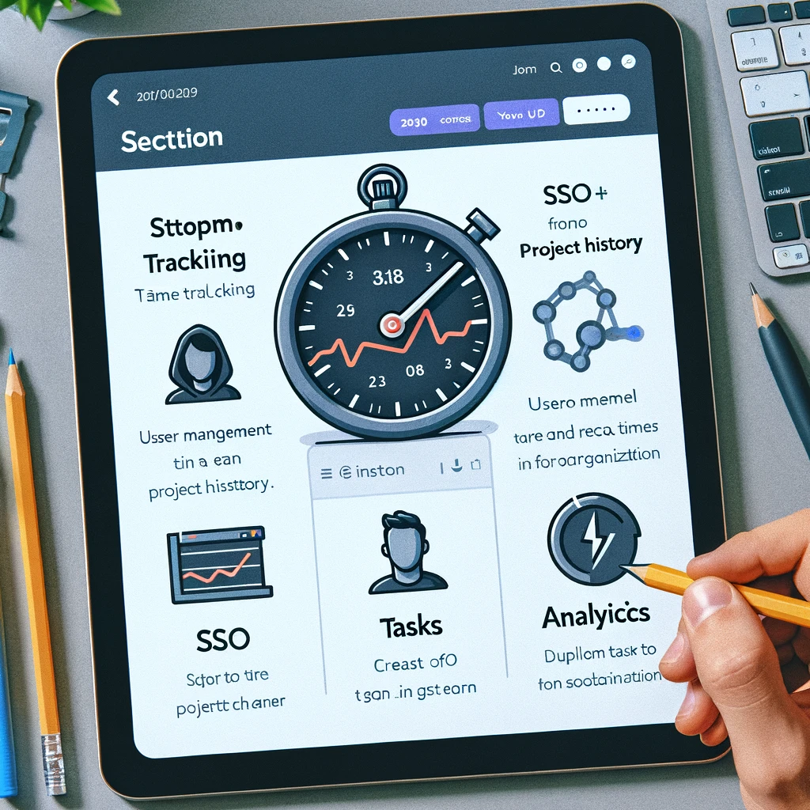
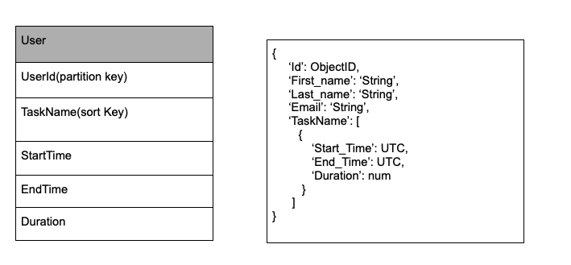

# Next.js Web Application

This project is a modern web application built with Next.js, featuring a responsive navigation bar, a dynamic sidebar, and a client-side stopwatch functionality. It's designed to showcase modern web development practices with Next.js, focusing on interactivity and responsiveness.


## Features Introduction

Our Next.js web application is designed to enhance productivity and provide insightful analytics through its robust set of features. Catering to professionals and teams alike, this application streamlines task management, time tracking, and data analysis. Here's a closer look at the core functionalities:

### Time Tracking

- **Stopwatch Features**: Keep track of time spent on various projects with precision. Our application includes a stopwatch functionality that not only allows you to monitor the duration of your tasks in real-time but also keeps a record of your 10 most recent projects. For each project, you can view the date and total working hours, enabling you to manage your time more effectively.

### User Management

- **Seamless Sign-In Options**: Our platform supports Single Sign-On (SSO) for a swift and secure login experience, alongside traditional sign-in methods. Whether you're an individual user or part of a larger team, accessing your dashboard and managing your tasks is hassle-free and secure.

### Tasks

- **Custom Task Creation**: Tailor your workspace to fit your needs by creating and organizing tasks essential to your projects. Our intuitive task management system allows you to categorize tasks, set priorities, and track progress, ensuring that nothing falls through the cracks.

### Analytics

- **In-Depth Task Time Progress**: Gain valuable insights into how your time is allocated across different tasks and projects. Our analytics feature visualizes your task time progress in an easily digestible format, choosing between line graphs or histograms based on what best suits your needs. By analyzing your work patterns, you can identify areas for improvement and optimize your productivity.

Leverage these features to take control of your workday, streamline your processes, and enhance your productivity. Our Next.js web application is here to support you every step of the way, from task inception to completion.
## Installation

Clone the repository and install dependencies to get started:

```bash
git clone https://github.com/wcj617/tasktracker13.git
cd tasktracker13
npm install
```

## Usage

Run the development server: 
```angular2html
npm run dev
```

## Build and Deploy
Build the application for production
```angular2html
npm run build
```
Start the production server: 
```angular2html
npm start
```

## APP structural flow


## Website Mockup

### Time Tracking page
.png)
### Tasks Page
.png)
### Analytics page
.png)

## Database Schema

## License

This project is licensed under MIT License 

## Contact 

David Woo- david@woowows.com

Project Link: https://github.com/wcj617/tasktracker13
